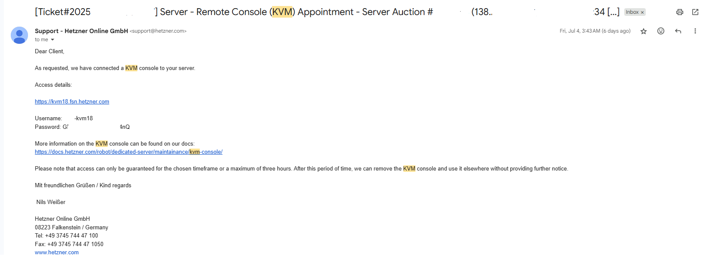

# Setting up Hetzner physical Server 

#### To setup our on premise environment, We need a physical server on which we can setup Vmware Esxi for virtualization

---

Purcahse a server from Hetzner cloud here : https://robot.hetzner.com/order

I chose the below configuartion 
- CPU : intel Core i7
- RAM : 4 * 16 
- SSD : 2 * 512

You would get the server delivered to you and you can access the server here : https://robot.hetzner.com/server

We would need to go to Support to raise KVM attached to your server so that you can access KVM console and mount Vmware Esxi ISO on top if it

---

In the meantime download Vmware Esxi ISO here : https://www.vmware.com/products/cloud-infrastructure/vsphere

---

Once you have raised the request, you would get the email with id and password within 1-2 hour to login to KVM console

---

#### Installation guide to mount Vmware EsXi on Hetzner physical Server

Login to KVM Console and use that to virtually mount an ISO file of the version of ESXi you want to install. You can find further information on ordering a KVM Console and using it to install an OS on the KVM Console page.

Console link : https://kvm18.fsn.hetzner.com/#/signin

Once logged in to KVM console 

Follow the Vmware installation on Hetzner cloud guide as mentioned in their article below: 
- https://docs.hetzner.com/robot/dedicated-server/maintenance/kvm-console/
- https://docs.hetzner.com/robot/dedicated-server/virtualization/vmware-esxi/#installation-guide

Follow the on screen instruction and above guide to mount Vmware esxi on Hetzner server, you would need to create root password 

You would get public ip address to access the Vmware Esxi, it's the same public ip assigned to your physical server.

---

