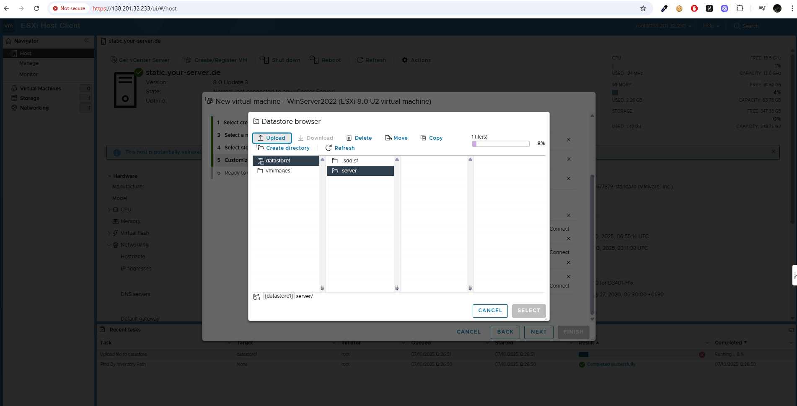

# Setting up VM in Vmware Esxi

## Log into Vmware Esxi with the password created at the time of setting up Vmware Esxi on Hetzner Cloud 

- The normal user name and password should be as below
- username : root
- password : password set at the time of setup of Vmware Esxi on Hetzner Cloud

### In the meantime Download Windows server from the link : https://info.microsoft.com/ww-landing-windows-server-2022.html

 Microsoft would ask to register to download the iso

### Once logged in to Vmware Esxi with root user and password with the public ip address provided by Hetzner VM
- It's given at the time of setup of Vmware Esxi on Hetzner cloud
- Normally its the same ip because we have installed Vmware Esxi directly on the Hetzner physical server using KVM provided by Hetzner Supporrt
- More about setting up Hetzner Cloud and Setting up Vmware Esxi on top of physical Server : 

### once
