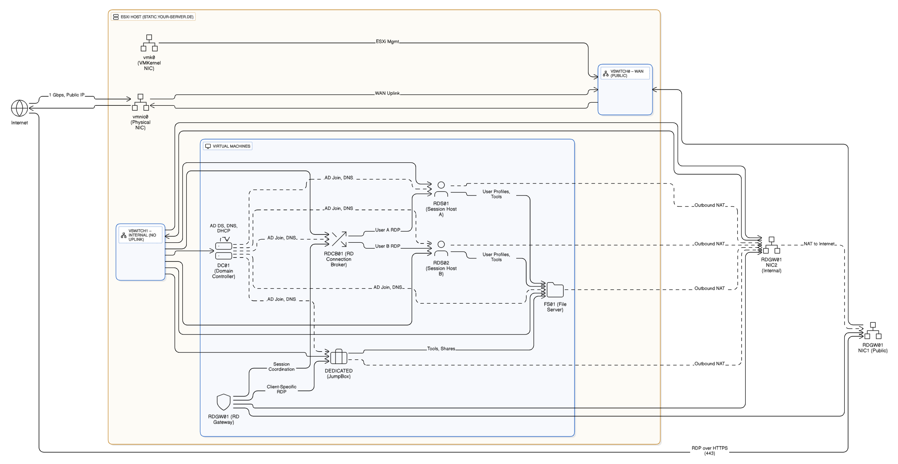
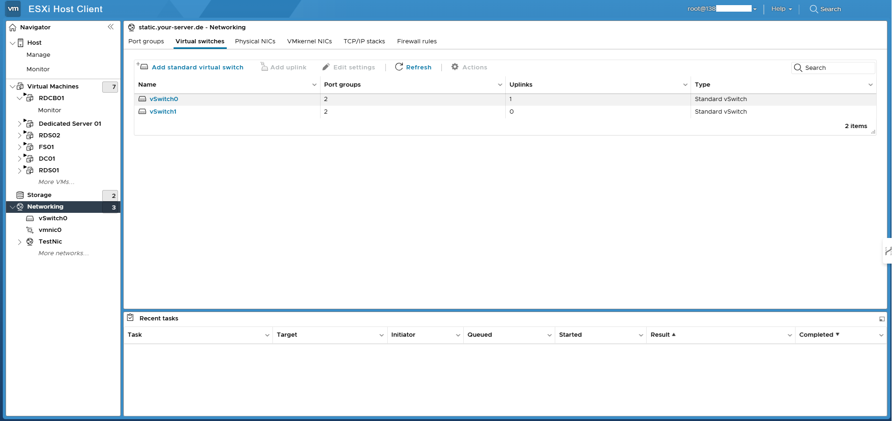
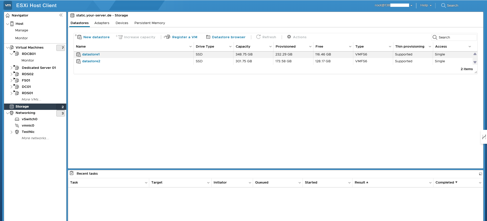

# Enterprise-Grade RDS Infrastructure on ESXi with RDGW-RDCB and DC 

## Objective

This infrastructure simulates a secure, enterprise-grade Remote Desktop Services (RDS) architecture hosted entirely on a VMware ESXi hypervisor running on a Hetzner bare-metal server.

It is designed to:

- Provide secure RDP access over the internet using HTTPS via RD Gateway
- Isolate internal infrastructure with a no-uplink internal vSwitch
- Use Active Directory for central identity and policy control
- Deploy multiple RDS hosts with load balancing via a Connection Broker
- Offer a realistic cloud-free production environment for learning, testing, or edge deployments

> This setup reflects real-world best practices used in regulated, air-gapped, or enterprise environments.

## Architecture Overview

| Component    | Role                          | IP Address         | Notes                               |
|--------------|-------------------------------|--------------------|-------------------------------------|
| DC01         | Domain Controller + DNS       | 192.168.0.3        | Root of infra.local                 |
| RDGW01       | RD Gateway (Dual NIC)         | 138.X.X.X / 192.168.0.1 | Public entrypoint, internal router |
| RDCB01       | RD Connection Broker          | 192.168.0.2        | Load balances RDS01/RDS02           |
| RDS01        | RD Session Host 1             | 192.168.0.4        | Full desktop sessions               |
| RDS02        | RD Session Host 2 + File Srv  | 192.168.0.5        | Combines RDS + SMB roles            |
| FS01         | Utility/File Server (Optional)| 192.168.0.6        | Admin tools, profiles, etc.         |
| Dedicated    | JumpBox (Direct RDP Only)     | 192.168.0.7        | Staging or external-access VM       |

## Platform Stack

- **Hypervisor**: VMware ESXi 8.0
- **Host**: Hetzner Dedicated Bare Metal
- **Networking**:
  - `vSwitch0 (WAN)` → With uplink to Hetzner public IP
  - `vSwitch1 (Internal)` → Air-gapped LAN for secure infra

## Networking Topology

### 🔹 vSwitch0 – Public

Connected to `vmnic0` (Hetzner uplink)

Hosts:
- RDGW01 Public NIC
- ESXi Host Management (`vmk0`)

Provides access to:
- Admin panel of ESXi
- HTTPS RDP Gateway (443)

### 🔹 vSwitch1 – Internal

- No uplink (no external internet access)
- Hosts all internal services: DC01, RDCB01, RDS01, RDS02, FS01, Dedicated
- RDGW01 bridges this network via its internal NIC

## Network Flow: HTTPS RDP (with Connection Broker)

1. 👩‍💻 User launches an RDP session
   - RDP client is configured with:
     - Gateway: 138.X.X.X (RDGW01, public IP)
     - Target: rdsfarm.infra.local (points to RDCB01)

2. 🔐 Client connects to RDGW01 via HTTPS (TCP 443)
   - RDGW01 receives encrypted RDP session wrapped in TLS

3. 🧠 RDGW01 contacts RDCB01 for session routing
   - RDCB01:
     - Authenticates user via DC01 (AD DS)
     - Checks for active sessions
     - Selects best session host (RDS01 or RDS02)

4. ↺ RDGW01 initiates an internal RDP (3389) to selected host
   - RDGW01 acts as reverse RDP proxy:
     - Forwards inputs/outputs securely
     - Prevents direct access to internal VM IPs

5. 🚧 Session runs end-to-end over HTTPS
   - Internally between RDGW01 → RDS0x
   - Externally tunneled back to user via HTTPS

## Role-by-Role Breakdown

### 🧠 DC01 – Domain Controller + DNS
- IP: 192.168.0.3 (vSwitch1)
- Hosts:
  - Active Directory Domain Services
  - DNS forward/reverse lookup

### 🔐 RDGW01 – Remote Desktop Gateway
- NICs:
  - Public: vSwitch0 → 138.X.X.X
  - Internal: vSwitch1 → 192.168.0.1
- Routes HTTPS → RDP based on RDCB01 decisions

### 🧠 RDCB01 – Connection Broker
- IP: 192.168.0.2
- Maintains session state and load balances RDS traffic

### 💻 RDS01 / RDS02 – Session Hosts
- RDS01: 192.168.0.4
- RDS02: 192.168.0.5
- Joined to domain and use FS01 for SMB shares (if configured)

### 📂 FS01 – File Server (Optional)
- IP: 192.168.0.6
- Used for ISO hosting, admin tools, profile storage

### 🧪 Dedicated – JumpBox / Test VM
- IP: 192.168.0.7
- Not in RD farm; used for direct RDP testing or staging

## Test Scenarios

| Scenario                  | Expected Result                                 |
|--------------------------|--------------------------------------------------|
| RDP via RDGW01           | HTTPS tunnel to RDS host via Broker             |
| DNS Resolution via DC01  | rds01.infra.local resolves correctly            |
| Domain Join              | All hosts joined to infra.local                 |
| NAT via RDGW01 (optional)| Internet access possible if RRAS enabled        |
| Direct RDP Block         | 192.168.0.x not accessible externally           |
| Isolation Check          | No uplink on vSwitch1 confirms air-gap          |

## 🚧 Future Enhancements

- Enable RRAS on RDGW01 for internet access to internal VMs
- Add pfSense for advanced NAT + firewall policies
- Deploy public SSL on RDGW01 for secure cert-based RDP
- Set up centralized EventLog and RDP session monitoring
- Apply FSLogix for profile management on RDS hosts
- Implement HA and clustering for RDGW01 and RDS farm

## Why This Setup Is Valuable

### ✅ Real-World Enterprise Architecture
- Secure remote access via HTTPS
- AD-integrated authentication
- Segregated subnets and network flow

### 🌍 Cloud-Free, Self-Hosted Lab
- No dependency on AWS/Azure
- Ideal for air-gapped, private, or edge environments

> 🔗 This lab mirrors how real companies deploy Remote Access – from scratch, with full control over each layer.

## Screenshots from Esxi

Virtual Machines

Switch

Port Groups

Storage

