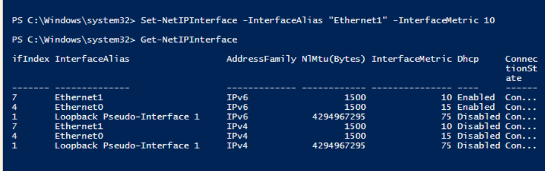

# RD Gateway (RDGW01) – Full Technical Theory, Role Requirements & Correlation

## 1. What is an RD Gateway?
The **Remote Desktop Gateway (RDGW)** is a Windows Server role that acts as a **secure proxy** for Remote Desktop Protocol (RDP) connections.  
It allows external clients to connect to internal RDP hosts **securely over HTTPS (TCP 443)** instead of exposing raw RDP (TCP 3389) to the internet.

---

## 2. Why RD Gateway is Needed
Without RD Gateway, you have two bad options for external RDP:
1. **Expose RDP (TCP 3389) directly to the internet** – insecure and vulnerable to brute-force attacks.
2. **VPN into the network first** – more secure but requires extra configuration and maintenance.

**RD Gateway solves this by:**
- Terminating RDP over HTTPS (443) on the public NIC.
- Decrypting and forwarding RDP internally to session hosts (RDSH) or RDCB.
- Providing **policy-based access control** for both *who* can connect and *what* they can connect to.
- Supporting SSL/TLS encryption without opening RDP to the internet.
- Allowing secure access without a full VPN.

---

## 3. How RD Gateway Works in This Lab
Your setup:
- **RDGW01** has **two NICs**:
  - **Public NIC**: Internet-facing IP (138.x.x.x) – listens for HTTPS RDP connections.
  - **Internal NIC**: LAN IP (192.168.0.1) – connects to internal RDS hosts.
- Clients connect using **mstsc.exe** configured with the RD Gateway hostname or IP.
- The RD Gateway authenticates the user using **NPS policies**.
- Once authorized, it forwards the RDP session internally to:
  - **RDCB01** (Connection Broker) → Determines which RDS host (RDS01 or RDS02) to use.
  - Or a dedicated RDP host (DEDICATED01).

---

## 4. Required Roles/Features on RDGW01 and Why

| Role / Feature | Install on RDGW01? | Why It’s Needed |
|----------------|--------------------|-----------------|
| **Remote Desktop Gateway** (`RDS-Gateway`) | ✅ **Yes** | Core service – encapsulates RDP inside HTTPS (443) and proxies to internal RDP hosts. |
| **Network Policy and Access Services** (`NPAS`) → **Network Policy Server (NPS)** | ✅ **Yes** | Processes **Connection Authorization Policies (CAP)** (who can connect) and **Resource Authorization Policies (RAP)** (what they can connect to). |
| **Remote Desktop Licensing** (`RDS-Licensing`) | ⚠️ Optional (but required in production) | Manages RDS CALs. Without it, you have a 120-day grace period. |
| **Routing and Remote Access Service (RRAS)** | ✅ If doing NAT/routing | Needed if RDGW01 also routes outbound internet traffic for LAN VMs or acts as a NAT gateway for RDP traffic. |
| **Web Server (IIS)** *(auto-installed)* | Auto | Provides the HTTP/S listener for RD Gateway. |
| **Certificate Services** *(optional)* | Optional | Needed if issuing your own SSL certificates instead of public CA. |

---

## 5. What Each Component Does and How They Interconnect

1. **Remote Desktop Gateway**  
   - Accepts inbound HTTPS RDP traffic.
   - Terminates TLS/SSL.
   - Passes decrypted RDP to internal servers.

2. **NPS (Network Policy Server)**  
   - Integrated with RD Gateway to decide **who can connect** (CAP) and **where they can connect** (RAP).
   - Enforces AD-based authentication.

3. **RRAS (NAT/Router)** *(only if using NAT)*  
   - Routes packets between the public and internal network.
   - Allows LAN VMs to access the internet through RDGW01’s public NIC.
   - NATs outbound traffic to mask internal IPs.

4. **SSL Certificate**  
   - Ensures TLS encryption for RDP over HTTPS.
   - Public certs prevent client trust errors.

5. **IIS (dependency)**  
   - Provides the web-based endpoint for RDP over HTTPS.

---

## 6. Why Each Step in Setup is Necessary

| Step | Why It’s Necessary | How It Relates to Others |
|------|-------------------|--------------------------|
| **Join Domain** | Allows RDGW01 to use AD authentication for CAP/RAP policies. | Ties directly into NPS for policy enforcement. |
| **Assign Static IPs (Dual NIC)** | Ensures stable connectivity on both internal and external networks. | NAT and routing require fixed IPs. |
| **Install RD Gateway Role** | Provides the core functionality of secure RDP proxy. | Works with NPS to authorize and forward connections. |
| **Enable RRAS NAT** | Required if RDGW01 provides internet to LAN. | Works with routing to connect internal RDS hosts to internet. |
| **Configure CAP/RAP Policies** | Defines security rules for RDP access. | Prevents unauthorized use of RD Gateway. |
| **Bind SSL Certificate** | Encrypts traffic to prevent interception. | Without it, clients will get security warnings. |

---

 # RDGW01 – Remote Desktop Gateway Setup Process

- **Hostname**: RDGW01  
- **IP Address**:  
  - Internal: `192.168.0.1`  
  - Public: `138.x.x.x`  
- **Roles**: Remote Desktop Gateway, NAT Router, RDP Reverse Proxy  
- **Domain**: `infra.local` (joined)

## 🔹 Step 1: Rename and Join Domain

### Rename:
- Open `sysdm.cpl`
- Set computer name to `RDGW01`
- Restart

### Join Domain:
- After reboot, go to:
  - System → Change Settings → Domain: `infra.local`
- Use credentials for domain join (e.g. `infra\domainadmin`)
- Reboot again

## 🔹 Step 2: Assign Static IPs (Dual NIC Configuration)

### Internal NIC:

| Setting         | Value         |
|----------------|---------------|
| IP Address      | 192.168.0.1   |
| Subnet Mask     | 255.255.255.0 |
| Default Gateway | (leave blank) |
| Preferred DNS   | 192.168.0.3   |

### Public NIC:

| Setting         | Value              |
|----------------|--------------------|
| IP Address      | 138.x.x.x          |
| Subnet Mask     | Provider-specific  |
| Default Gateway | Provider gateway   |
| Preferred DNS   | 8.8.8.8, 1.1.1.1   |

> Ensure internal NIC is at the top of binding order



```powershell
Get-NetAdapterBinding -ComponentID ms_tcpip6
```

## 🔹 Step 3: Install RD Gateway Role

### Using Server Manager:
- Add Roles and Features → Role-Based → RDGW01
- Check:
  - [x] Remote Desktop Services
  - [x] Remote Desktop Gateway
- Click Next → Install

### Using PowerShell:
```powershell
Install-WindowsFeature RDS-Gateway -IncludeManagementTools
```

## 🔹 Step 4: Configure Routing and Remote Access (NAT)

> This turns RDGW01 into a NAT router between public and internal networks

### Steps:
1. Open **Server Manager** → Tools → **Routing and Remote Access**
2. Right-click RDGW01 → Configure and Enable Routing
3. Select: **Network Address Translation (NAT)**
4. Select **Public interface** (your 138.x.x.x NIC)
5. Enable NAT on it
6. Add internal NIC as **private interface**

### Confirm NAT works:
```powershell
Get-NetNat
Get-NetRoute
```

## 🔹 Step 5: Configure RD Gateway Policies

### Open: **Remote Desktop Gateway Manager**
1. Create a **Connection Authorization Policy (CAP)**:
   - Allow domain users
   - Use password authentication

2. Create a **Resource Authorization Policy (RAP)**:
   - Allow access to internal RDS hosts: `RDS01`, `RDS02`, `DEDICATED01`


## 🔹 Step 6: Bind SSL Certificate for RD Gateway

### Steps:
- Open RD Gateway Manager
- Right-click RDGW01 → Properties → SSL Certificate Tab
- Choose:
  - Use a self-signed cert (test)
  - Or import a public cert with Common Name: `rdgw01.infra.local` or public DNS name

> Optionally generate a self-signed cert:
```powershell
New-SelfSignedCertificate -DnsName "rdgw01.infra.local" -CertStoreLocation "cert:\LocalMachine\My"
```

## 🔹 Step 7: Test External RDP Connection

### From external client:
- Open `mstsc.exe`
- Go to `Advanced → Settings...`
- Enable Gateway:
  - RD Gateway server: `138.x.x.x` or `rdgw01.infra.local`

### Remote Computer:
- Example: `rds01.infra.local` or `rdfarm.infra.local`

> 🔐 RDGW01 will:
> - Accept the HTTPS RDP connection on 443
> - Internally initiate RDP to RDS01 or RDS farm (RDCB01)
> - If connecting to a farm, will forward session to RDCB01
> - RDCB01 decides which session host to use
> - RDGW01 then opens final TCP 3389 to that RDS host (e.g., RDS02)

## 🔹 Step 8: Validate NAT for Outbound Internet (Optional)

### From internal VMs (like RDS01, DC01):
- Try accessing internet (e.g. ping 8.8.8.8 or browse site)

### On RDGW01:
- Check NAT session table:
```powershell
Get-NetNatSession
```

> Confirm packets are being NAT’d through RDGW01's public NIC.

## ✅ Final Outcome

- RDGW01 now allows **secure, encrypted RDP** access from the internet to internal-only servers
- NAT routing enables internet access for internal VMs
- Session redirection via RDCB01 is handled transparently
- Gateway policies + SSL + AD integration = enterprise-grade hardened access
