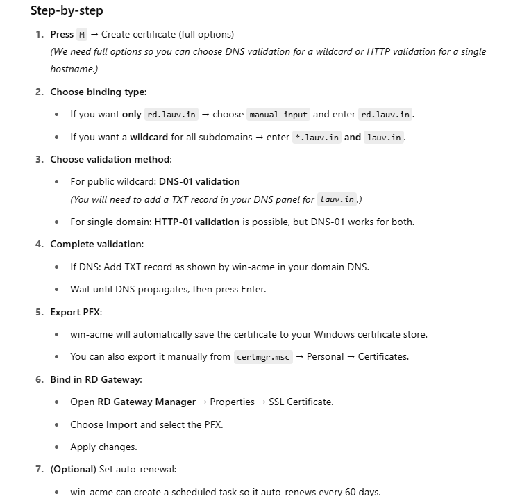

# Exchange Server 2019 Setup & Configuration Guide (EX01 - mail.lauv.in)

## 1. Introduction

Microsoft Exchange Server 2019 is an enterprise-grade email, calendaring, contact, and task management system.
It integrates seamlessly with Active Directory (AD) to provide secure, policy-driven email services.
In this lab, **EX01** acts as the on-premises Exchange Server, hosting mailboxes and services for the `lauv.in` domain.

This configuration is part of a **future hybrid setup** with Microsoft 365, allowing for either a **hybrid migration** or **cutover migration** depending on future requirements.

---

## 2. Prerequisites

### Hardware & OS
- **CPU**: Minimum 4 cores
- **RAM**: Minimum 8 GB (Lab) / 128 GB (Production recommended)
- **Disk**: SSD preferred, separate disks for OS, logs, and databases
- **OS**: Windows Server 2019 Standard/Datacenter (GUI)

### Active Directory
- **DC01** provides domain services (`infra.local`).
- EX01 must be **domain-joined**.
- AD Schema must be prepared before installation.

### Internal DNS
- Create **A records** for:
  - `mail.lauv.in` → Internal IP of EX01
  - `autodiscover.lauv.in` → Internal IP of EX01

### External DNS
- **A record**: `mail.lauv.in` → Public IP (NAT to EX01)
- **A record**: `autodiscover.lauv.in` → Public IP (NAT to EX01)
- **MX record**: Points to `mail.lauv.in`
- **SRV record** (optional for Autodiscover redundancy)

### Firewall & NAT
Forward these ports from the public internet to EX01:
- **443** (HTTPS - OWA, ECP, Outlook Anywhere, ActiveSync)
- **25** (SMTP - inbound mail)
- **587** (SMTP Submission - outbound mail)

### SSL Certificate
You already have a certificate covering:
```
mail.lauv.in
autodiscover.lauv.in
```
It needs to be imported into EX01 and assigned to **IIS** and **SMTP**.

---

## 3. Installing Exchange Server 2019

1. Install **Windows prerequisites**:
```powershell
Install-WindowsFeature Server-Media-Foundation, RSAT-ADDS, NET-Framework-Features, Web-Server, Web-Mgmt-Console, WAS-Process-Model, RSAT-Clustering
```

2. Prepare Active Directory:
```powershell
Setup.exe /PrepareSchema /IAcceptExchangeServerLicenseTerms
Setup.exe /PrepareAD /OrganizationName:"ITBD" /IAcceptExchangeServerLicenseTerms
Setup.exe /PrepareAllDomains /IAcceptExchangeServerLicenseTerms
```

3. Install Exchange Mailbox Role:
```powershell
Setup.exe /Mode:Install /Roles:Mailbox /IAcceptExchangeServerLicenseTerms
```

---

## 4. Post-Installation Configuration

### Set Internal & External URLs
These commands configure where clients connect.

```powershell
Set-ClientAccessService -Identity EX01 -AutoDiscoverServiceInternalUri https://autodiscover.lauv.in/autodiscover/autodiscover.xml
```
- **Purpose**: Points Outlook clients to the correct Autodiscover endpoint.

```powershell
Set-OutlookAnywhere -Identity "EX01\Rpc (Default Web Site)" -ExternalHostname mail.lauv.in -ExternalClientsRequireSsl $true -InternalClientsRequireSsl $true -IISAuthenticationMethods Basic,NTLM
```
- **Purpose**: Configures Outlook Anywhere (RPC over HTTPS).

```powershell
Set-OwaVirtualDirectory -Identity "EX01\owa (Default Web Site)" -ExternalUrl https://mail.lauv.in/owa -InternalUrl https://mail.lauv.in/owa
```
- **Purpose**: Sets URLs for Outlook Web Access.

```powershell
Set-EcpVirtualDirectory -Identity "EX01\ecp (Default Web Site)" -ExternalUrl https://mail.lauv.in/ecp -InternalUrl https://mail.lauv.in/ecp
```
- **Purpose**: Sets URLs for the Exchange Control Panel.

```powershell
Set-ActiveSyncVirtualDirectory -Identity "EX01\Microsoft-Server-ActiveSync (Default Web Site)" -ExternalUrl https://mail.lauv.in/Microsoft-Server-ActiveSync -InternalUrl https://mail.lauv.in/Microsoft-Server-ActiveSync
```
- **Purpose**: Configures mobile device connectivity.

```powershell
Set-WebServicesVirtualDirectory -Identity "EX01\EWS (Default Web Site)" -ExternalUrl https://mail.lauv.in/EWS/Exchange.asmx -InternalUrl https://mail.lauv.in/EWS/Exchange.asmx
```
- **Purpose**: Configures Exchange Web Services for Outlook integration.

---

## 5. SSL Certificate Installation & Binding

1. Import your SSL certificate:
```powershell
Import-ExchangeCertificate -FileData ([Byte[]]$(Get-Content -Path "C:\certs\mail_lauv_in.pfx" -Encoding Byte -ReadCount 0)) -Password (ConvertTo-SecureString -String "YourPassword" -AsPlainText -Force)
```

2. Assign certificate to IIS and SMTP:
```powershell
Enable-ExchangeCertificate -Thumbprint <Thumbprint> -Services "IIS,SMTP"
```

---

## 6. Mail Flow

### Send Connector
```powershell
New-SendConnector -Name "Internet Send Connector" -Usage Internet -AddressSpaces * -SmartHosts smtp.yourisp.com -SmartHostAuthMechanism None -DNSRoutingEnabled $false -UseExternalDNSServersEnabled $true
```

### Receive Connector
```powershell
New-ReceiveConnector -Name "Internet Receive Connector" -Usage Internet -Bindings 0.0.0.0:25 -RemoteIPRanges 0.0.0.0-255.255.255.255
```

---

## 7. Testing

- Test OWA: `https://mail.lauv.in/owa`
- Test ECP: `https://mail.lauv.in/ecp`
- Test Autodiscover: `Test-OutlookWebServices`
- Test Mail Flow: `Test-Mailflow`

---

## 8. Security Best Practices

- Keep Exchange updated (CU + SU).
- Restrict SMTP relay to trusted IPs.
- Disable legacy protocols if not needed (POP, IMAP).
- Use strong SSL/TLS.

---

## 9. Future Hybrid Migration

With Exchange 2019 in place:
- **Hybrid model** allows coexistence between Exchange Online and on-premises mailboxes.
- Requires **Azure AD Connect** for directory synchronization.
- Hybrid wizard configures mail flow & Autodiscover between environments.

**Cutover migration**:
- Move all mailboxes to Microsoft 365 in one go.
- Decommission Exchange after migration.

---

## Conclusion

You now have a functional Exchange Server 2019 environment ready for internal/external mail flow and hybrid preparation.


### Certificate part 

