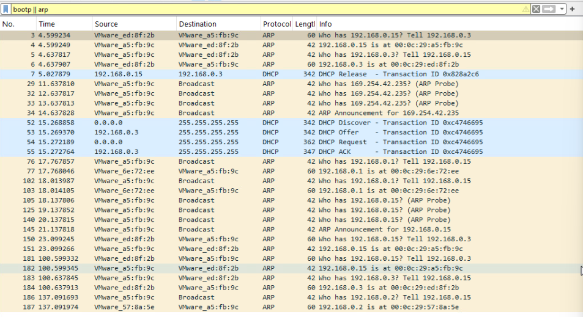

# DHCP and ARP Lab Documentation

This document explains the process of **DHCP and ARP resolution** as captured in Wireshark based on the provided screenshots.  
It includes **theory**, **lab actions taken**, and **expectation vs. result** analysis.

---

## **1. Lab Environment**
- **Platform:** VMware ESXi
- **Client VM:** Windows machine
- **Server:** Domain Controller (DC) with DHCP & DNS roles
- **Tool:** Wireshark on the client
- **Goal:** Observe the DHCP lease process and ARP resolution

---

## **2. Theory Recap**

### **DHCP Process (DORA)**
1. **Discover:** Client broadcasts a request to find any available DHCP server.
2. **Offer:** DHCP server responds with an IP offer.
3. **Request:** Client requests the offered IP.
4. **ACK:** DHCP server acknowledges and assigns the IP.

**Key Points:**
- Uses **UDP ports** 67 (server) and 68 (client).
- Broadcast is used until an IP is assigned.
- Packet source IP is `0.0.0.0` before IP assignment.

---

### **ARP Process**
ARP (Address Resolution Protocol) maps an **IP address → MAC address**.

**Typical ARP flow after DHCP:**
1. **Gratuitous ARP / ARP Probe:** Check if the assigned IP is already in use.
2. **Who has X? Tell Y:** Client asks who owns a specific IP.
3. **ARP Reply:** Device responds with its MAC address.

---

## **3. Actions Taken in Lab**
1. Opened Wireshark on **Ethernet0** interface.
2. Applied filter:
   ```
   bootp || arp
   ```
3. Ran:
   ```powershell
   ipconfig /release
   ipconfig /renew
   ```
   This forced a DHCP Release followed by a new DORA sequence.

---

## **4. Captured DHCP Sequence**

| Step | Source → Destination | Protocol | Info |
|------|----------------------|----------|------|
| **Release** | `192.168.0.15 → 192.168.0.3` | DHCP | DHCP Release - Old IP returned |
| **Discover** | `0.0.0.0 → 255.255.255.255` | DHCP | Client broadcasts looking for DHCP server |
| **Offer** | `192.168.0.3 → 255.255.255.255` | DHCP | Server offers an IP |
| **Request** | `0.0.0.0 → 255.255.255.255` | DHCP | Client requests offered IP |
| **ACK** | `192.168.0.3 → 255.255.255.255` | DHCP | Server confirms lease |

**Theory vs Result:**
- Expected: DORA process should complete.
- Result: DORA completed successfully, confirming DHCP server is functioning.


---

## **5. Captured ARP Sequence**

### Before DHCP
- APIPA (169.254.x.x) ARP probes were sent when DHCP was not yet assigned.

### After DHCP
- ARP Requests to resolve gateway, DHCP server, and other LAN devices.
- Example:
  - `Who has 192.168.0.3? Tell 192.168.0.15` → Find MAC of DHCP/DNS server.

**Theory vs Result:**
- Expected: Client performs ARP lookup for default gateway and DHCP/DNS server.
- Result: Exactly observed as expected.

---

## **6. Expectations vs Reality Table**

| Stage | Expectation | Actual Result |
|-------|-------------|--------------|
| DHCP Discover | Client sends broadcast from `0.0.0.0` | ✅ Observed |
| DHCP Offer | Server offers IP | ✅ Observed |
| DHCP Request | Client requests offered IP | ✅ Observed |
| DHCP ACK | Server confirms IP lease | ✅ Observed |
| ARP Probe | Client checks for duplicate IP | ✅ Observed |
| ARP Resolution | Client resolves MAC of gateway/DNS | ✅ Observed |

---

## **7. Conclusion**
- DHCP and ARP processes worked as per protocol theory.
- The lab successfully demonstrated how a Windows client interacts with DHCP and ARP after forcing an IP renewal.
- The observed packets match expected behavior exactly.

---
